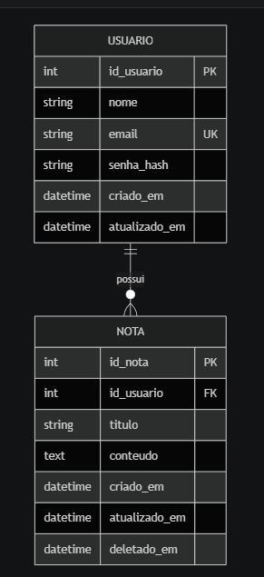

<p id="desc"></p>

# :black_nib: Scriba

Suas Ideias em Ordem 

O Scriba é um aplicativo de gerenciamento de notas pessoais desenvolvido em Flutter. Ele permite que usuários organizem seus pensamentos de forma rápida, segura e persistente, contando com uma interface intuitiva e suporte a múltiplos perfis de usuário localmente.

```Em desenvolvimento```


## :mag_right: Menu 

<ul>
    <li>
        <a href="#desc">Descrição</a>
    </li>
    <li>
        <a href="#func">Funcionalidades Atuais</a>
    </li>
    <li>
        <a href="#tec">Tecnologias Utilizadas</a>
    </li>
	<li>
        <a href="#estrutura">Estrutura do repositório</a>
    </li>
	<li>
        <a href="#stack">Stack técnica</a>
    </li>
    <li>
        <a href="#rodar">Como rodar</a>
    </li>
    <li>
        <a href="#modelodb">Modelo de dadosl</a>
    </li>
    <li>
        <a href="#pesistencia">Persistência e ambiente</a>
    </li>
    <li>
        <a href="#fluxo">Fluxo funcional</a>
    </li>
    <li>
        <a href="#colaboradores">Colaboradores</a>
    </li>
</ul>


<p id="func"></p>

## Funcionalidades Atuais

- Gestão de Notas (CRUD): Criação, leitura, ordenação e exclusão de notas.

- Persistência Local: Integração total com banco de dados SQLite para garantir que os dados não sejam perdidos ao fechar o app.

- Busca Inteligente: Filtro em tempo real por título de nota diretamente na tela inicial.

- Interface Responsiva: Layout adaptável para modo retrato (portrait) e paisagem (landscape), corrigindo problemas de overflow em telas menores.


<p id="tec"></p>

## Tecnologias Utilizadas

- Linguagem: Dart

- Framework: Flutter

- Banco de Dados: SQLite (via sqflite)

- Arquitetura: Clean Code e separação de estados com StatefulWidgets.

- Design: Prototipado no Figma.


<p id="estrutura"></p>

## Estrutura do repositório

- `./`: app Flutter principal.
- `lib/`: código de telas e camada de dados.
- `web/`: arquivos da versão web, incluindo assets do SQLite web.


<p id="stack"></p>

## Stack técnica

- Flutter 3.41.x
- Dart 3.11.x
- SQLite via `sqflite`
- Suporte SQLite em desktop/web via `sqflite_common_ffi` e `sqflite_common_ffi_web`


<p id="rodar"></p>

## :rocket: Como rodar
Clone o repo: git clone https://github.com/seu-usuario/scriba.git

Rode ```flutter upgrade```

Rode ```flutter pub get```

Pressione ```Ctrl + Shift + P``` (Windows/Linux) ou ```CMD + Shift + P``` (Mac).

Digite "Dart: Restart Analysis Server".

Selecione a opção e aguarde alguns segundos até que o motor de análise processe o projeto novamente.

Conecte um emulador ou celular e dê ```flutter run```


<p id="modelodb"></p>

## Modelo de dados (resumo)

Entidades:

- `usuario`
	- `id_usuario` (PK)
	- `nome`
	- `email` (UNIQUE)
	- `senha_hash`
	- `criado_em`
	- `atualizado_em`

- `nota`
	- `id_nota` (PK)
	- `id_usuario` (FK -> usuario.id_usuario)
	- `titulo`
	- `conteudo`
	- `criado_em`
	- `atualizado_em`
	- `deletado_em` (soft delete)

Relacionamento:

- Um usuário possui várias notas (1:N).




<p id="persistencia"></p>

## Persistência e ambiente

- Em Web: os dados são salvos no IndexedDB do navegador.
- Em Android/Desktop: os dados ficam em armazenamento local do app.
- Os dados locais não são enviados no `git push`; somente código vai para o repositório.


<p id="fluxo"></p>

## Fluxo funcional

1. Usuário se cadastra.
2. Usuário faz login.
3. App carrega notas vinculadas ao usuário logado.
4. Usuário cria, edita e exclui notas.
5. Exclusão de nota é lógica (`deletado_em`).


<p id="colaboradores"></p>

## :busts_in_silhouette: Colaboradores

Giovana Pereira Gustavo

Isabel Queiroz Almeida

Isaias Neri da Conceição Junior