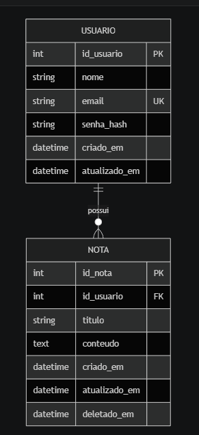

<h1> ✒️ Scriba</h1>

<em>Suas Ideias em Ordem</em>

O Scriba é um aplicativo de gerenciamento de notas pessoais desenvolvido em Flutter. Ele permite que usuários organizem seus pensamentos de forma rápida, segura e persistente, contando com uma interface intuitiva e suporte a múltiplos perfis de usuário localmente. O ecossistema inclui uma arquitetura cliente-servidor integrada por meio de microsserviços e um proxy reverso dedicado para autenticação distribuída e inteligência artificial.

<h2 id="menu">🔍 Menu</h2>
<ul>
    <li><a href="#desc">Descrição</a></li>
    <li><a href="#func">Funcionalidades Atuais</a></li>
    <li><a href="#tec">Tecnologias Utilizadas</a></li>
    <li><a href="#estrutura">Estrutura do Repositório</a></li>
    <li><a href="#stack">Stack Técnica</a></li>
    <li><a href="#arquitetura-e-ambiente">Arquitetura de Rede e Ambiente</a></li>
    <li><a href="#rodar">Como Rodar</a></li>
    <li><a href="#modelodb">Modelo de Dados</a></li>
    <li><a href="#persistencia">Persistência e Ambiente</a></li>
    <li><a href="#fluxo">Fluxo Funcional</a></li>
    <li></li>
</ul>

<h2 id="func">Funcionalidades Atuais</h2>
<ul>
    <li><strong>Gestão de Notas (CRUD):</strong> Criação, leitura, ordenação e exclusão de notas associadas ao perfil ativo.</li>
    <li><strong>Persistência Multiplataforma:</strong> Integração híbrida total com banco de dados estruturado SQLite para persistência física local.</li>
    <li><strong>Busca Inteligente:</strong> Mecanismo de filtro em tempo real por título de nota integrado diretamente na barra de pesquisa da tela inicial.</li>
    <li><strong>Interface Responsiva:</strong> Design responsivo adaptável para modo retrato (<em>portrait</em>) e paisagem (<em>landscape</em>), aplicando heurísticas de usabilidade e acessibilidade com prevenção robusta contra estouros de layout (<em>overflow</em>).</li>
    <li><strong>Barra de Ferramentas e Dev Runner Inteligente:</strong> Script utilitário em Dart para orquestração automática.</li>
</ul>

<h2 id="tec">Tecnologias Utilizadas</h2>
<ul>
    <li><strong>Linguagem:</strong> Dart</li>
    <li><strong>Framework:</strong> Flutter</li>
    <li><strong>Banco de Dados:</strong> SQLite (via <code>sqflite</code>)</li>
    <li><strong>Arquitetura:</strong> Princípios de Clean Code, Programação Assíncrona robusta (<code>Future</code>/<code>Stream</code>), e separação rígida de estados usando <code>StatefulWidgets</code> e fluxos reativos de controle.</li>
    <li><strong>Design UI/UX:</strong> Prototipado no Figma com foco em heurísticas de usabilidade, padrões visuais modernos e acessibilidade digital.</li>
    <li><strong>DevOps &amp; Infraestrutura Local:</strong> Automação de processos usando PowerShell para monitoramento e encerramento forçado de soquetes de rede TCP (<code>Get-NetTCPConnection</code>), além de suporte nativo a ferramentas do Android SDK (<code>adb</code>).</li>
</ul>

<h2 id="estrutura">Estrutura do Repositório</h2>
<ul>
    <li><code>./</code>: Raiz do app Flutter principal e arquivos de configuração.</li>
    <li><code>lib/</code>: Código-fonte central contendo as interfaces gráficas (telas), componentes e a camada de controle de dados.</li>
    <li><code>tool/</code>: Ferramentas avançadas de infraestrutura local de desenvolvimento:
        <ul>
            <li><code>api_proxy_server.dart</code>: Servidor de desenvolvimento baseado em <code>HttpServer</code> que atua como proxy reverso Cross-Origin (CORS) distribuindo requisições locais para os microsserviços cloud de Autenticação (<code>/proxy/auth</code>) e Inteligência Artificial (<code>/proxy/ia</code>).</li>
            <li><code>dev_runner.dart</code>: Utilitário de linha de comando (<em>Orchestrator Script</em>) que automatiza a identificação do ambiente operacional, limpa processos fantasmas da porta <code>8080</code>, configura tunelamento nativo e injeta flags de compilação.</li>
        </ul>
    </li>
    <li><code>web/</code>: Arquivos estruturais e configurações nativas della versão Web, contendo os assets estáveis para injeção e ciclo de vida do SQLite Web baseado em WASM.</li>
</ul>

<h2 id="stack">Stack Técnica</h2>
<ul>
    <li><strong>Flutter SDK:</strong> 3.x (com suporte moderno à migração declarativa de Gradle e Kotlin nativo)</li>
    <li><strong>Dart SDK:</strong> ^3.11.3</li>
    <li><strong>Banco de Dados Local:</strong> <code>sqflite</code> (Core para dispositivos móveis)</li>
    <li><strong>Abstração Cross-Platform de Banco:</strong> <code>sqflite_common_ffi</code> e <code>sqflite_common_ffi_web</code> para suporte unificado a SQLite em ambientes Windows Desktop e Web Browsers.</li>
    <li><strong>Manipulação de Documentos:</strong> <code>syncfusion_flutter_pdf</code> para exportação e processamento avançado de relatórios em formato PDF.</li>
    <li><strong>Utilitários do Ecossistema:</strong> <code>file_picker</code> (v11.0.2+) com compatibilidade nativa e limpa ao Built-in Kotlin Gradle Plugin (KGP), <code>open_filex</code>, <code>path</code> e <code>http</code>.</li>
</ul>

<h2 id="arquitetura-e-ambiente">Arquitetura de Rede e Ambiente</h2>

O ecossistema do Scriba adota injeção estática em tempo de compilação utilizando a flag do ecossistema Dart <code>--dart-define</code>. A comunicação externa é completamente parametrizada através della variável de ambiente <code>SCRIBA_PROXY_BASE_URL</code>.

O servidor proxy (<code>api_proxy_server.dart</code>) opera na porta de rede <code>8080</code> utilizando ligação de escuta global (<code>InternetAddress.anyIPv4</code> / <code>0.0.0.0</code>), interceptando e higienizando cabeçalhos impeditivos como <code>Host</code>, <code>Origin</code> e <code>Content-Length</code>, permitindo que múltiplos clientes enviem requisições com injeção automática de políticas flexíveis de CORS.

<h2 id="rodar">🚀 Como Rodar</h2>

<h3>Instruções de Execução</h3>
<ol>
    <li>
        
<strong>Clone o repositório:</strong>

<pre><code>git clone https://github.com/seu-usuario/scriba.git
cd scriba</code></pre>
    </li>
    <li>
        
<strong>Garanta as dependências atualizadas do ecossistema:</strong>

<pre><code>flutter pub get</code></pre>
    </li>
    <li>
        
<strong>Recarregue o Servidor de Análise (Se necessário):</strong>

        
Pressione <code>Ctrl + Shift + P</code> (Windows/Linux) ou <code>CMD + Shift + P</code> (Mac), digite <strong>"Dart: Restart Analysis Server"</strong> e selecione a opção.

    </li>
    <li>
        
<strong>Inicie o ambiente de desenvolvimento usando o Orquestrador Automático:</strong>

        
<strong>Execução Padrão (Ambiente Web / Google Chrome):</strong>

        
O orquestrador assumirá o Chrome automaticamente, liberará a porta de rede <code>8080</code> de processos travados, inicializará o proxy local em background e executará o cliente na porta de desenvolvimento <code>5000</code>:

<pre><code>flutter pub run tool\\dev_runner.dart</code></pre>
        
<strong>Execução Móvel Automatizada (Celular Android / Emulador):</strong>

        
O script executará um rastreamento completo de caracteres de codificação no terminal do Windows, isolará o identificador físico do seu celular conectado e aplicará automaticamente o encapsulamento de porta por meio de <strong>ADB Port Forwarding</strong> via barramento USB. Isso elimina dependências de IPs dinâmicos:
		

<pre><code>flutter pub run tool\\dev_runner.dart mobile</code></pre>
    </li>
</ol>

<h2 id="modelodb">Modelo de Dados</h2>

<h3>Entidades</h3>

<table>
    <thead>
        <tr>
            <th>Tabela</th>
            <th>Atributos / Campos</th>
            <th>Regras / Restrições</th>
        </tr>
    </thead>
    <tbody>
        <tr>
            <td><strong>usuario</strong></td>
            <td>
                <code>id_usuario</code> 
                <code>nome</code> 
                <code>email</code> 
                <code>senha_hash</code> 
                <code>criado_em</code> 
                <code>atualizado_em</code>
            </td>
            <td>
                INTEGER PK AUTOINCREMENT 
                TEXT 
                TEXT UNIQUE 
                TEXT 
                TEXT 
                TEXT
            </td>
        </tr>
        <tr>
            <td><strong>nota</strong></td>
            <td>
                <code>id_nota</code> 
                <code>id_usuario</code> 
                <code>titulo</code> 
                <code>conteudo</code> 
                <code>criado_em</code> 
                <code>atualizado_em</code> 
                <code>deletado_em</code>
            </td>
            <td>
                INTEGER PK AUTOINCREMENT 
                INTEGER FK (&rarr; usuario.id_usuario) 
                TEXT 
                TEXT 
                TEXT 
                TEXT 
                TEXT (Soft Delete)
            </td>
        </tr>
    </tbody>
</table>

<h3>Relacionamento</h3>
<ul>
    <li>Um usuário possui várias notas (<strong>1:N</strong>).</li>
</ul>

    

<h2 id="persistencia">Persistência e Ambiente</h2>
<ul>
    <li><strong>Web Browser:</strong> Os dados transacionais e de tabelas locais são mapeados diretamente para persistência no sub-sistema <code>IndexedDB</code> do navegador por meio da camada de tradução do <code>sqflite_common_ffi_web</code>.</li>
    <li><strong>Android / Desktop Nativo:</strong> Os dados são salvos localmente na sandbox segura de arquivos da aplicação dentro do armazenamento físico estável do dispositivo operacional.</li>
    <li><strong>Segurança de Repositório:</strong> Os bancos de dados e credenciais dinâmicas geradas localmente em tempo de execução são ignorados pelo arquivo <code>.gitignore</code> do repositório, garantindo que apenas códigos-fontes estáveis e limpos sejam enviados no <code>git push</code>.</li>
</ul>

<h2 id="fluxo">Fluxo Funcional</h2>
<ol>
    <li><strong>Cadastro de Conta:</strong> O usuário fornece os dados, gerando um registro estruturado inicial.</li>
    <li><strong>Autenticação:</strong> O fluxo valida o login do perfil por meio do Proxy, que faz a ponte com a API unificada em Cloud.</li>
    <li><strong>Carga Operacional:</strong> O aplicativo cliente consome o banco de dados e exibe apenas os registros de notas de posse exclusivas da chave estrangeira (<code>id_usuario</code>) logada.</li>
    <li><strong>Manipulação de Dados:</strong> O usuário gerencia seus registros na interface de busca e edição do ciclo de vida CRUD.</li>
    <li><strong>Encerramento de Nota:</strong> As notas excluídas passam pelo fluxo de remoção lógica (<code>deletado_em</code>), garantindo integridade transacional de dados.</li>
</ol>

<h2 id="colaboradores">👥 Colaboradores</h2>
<ul>
    <li>Giovana Pereira Gustavo</li>
    <li>Isabel Queiroz Almeida</li>
    <li>Isaias Neri da Conceição Junior</li>
</ul>